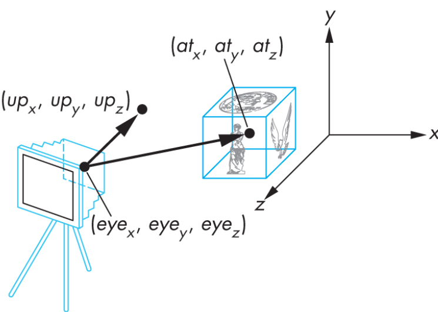
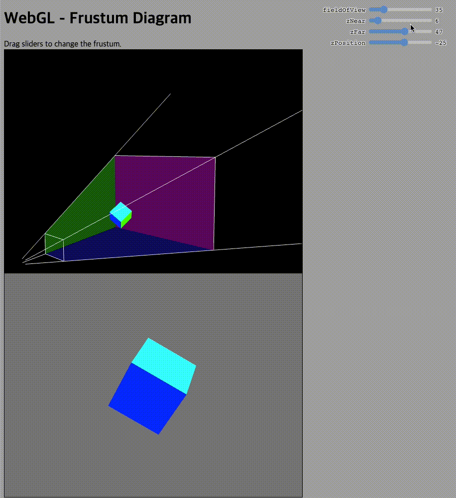

# WebGL Final Project

> **본 문서는 webGL의 가장 기초적인 부분인 Transform과 View/Projection에 대한 튜토리얼입니다.**

# Cube Basic

> 해당 Tab에서는 Cube의 Drawmode와 Transform에 대한 내용을 다룹니다.

## Drawmode

```javascript
void gl.drawArray(mode, first, count);
```

-   gl.POINTS(0): Draws a single dot.
-   gl.LINE_LOOP(2): Draws a straight line to the next vertex, and connects the last vertex back to the first.
-   gl.TRIANGLES(4): Draws a triangle for a group of three vertices.

각 mode마다 고유 숫자를 가지고 있기 때문에 직접 mode를 입력할 필요 없이 mode에 해당하는 숫자를 입력해도 해당 함수를 사용할 수 있습니다.
각 mode에 해당하는 숫자는 console창에서 gl.{mode}를 입력하여 확인할 수 있습니다.

### Examples

```javascript
gl.drawArrays(4, 0, 36); // 4는 gl.TRIANGLES에 해당하는 숫자입니다.
```

<hr>

## Transform

> Linear Transform의 종류로는 Translation, Rotation, Scaling이 있습니다.

### Translation

```javascript
mat4.translate(mMat, mMat, [xMove, yMove, zMove]);
```

-   물체를 이동시킵니다.

### Rotation

```javascript
mat4.rotateX(mMat, mMat, xRot);
mat4.rotateY(mMat, mMat, yRot);
mat4.rotateZ(mMat, mMat, zRot);
```

<p align = 'center'>

</p>

-   물체를 회전시킵니다.
-   Rotate은 축을 기준으로 동작하기 때문에 rotateX를 사용한 경우 Cube의 면은 x축 방향으로 회전하는게 아니라 x축과 수직인 방향으로 회전하게 됩니다.

### Scaling

```javascript
mat4.scale(mMat, mMat, [xScale, yScale, zScale]);
```

-   물체의 크기(비율)을 조절합니다.

<hr>

# LookAt

> 해당 Tab에서는 lookAt의 각 parameter에 대한 내용을 다룹니다.

```javascript
lookAt(out, eye, center, up);
```

<p align = 'center'>

</p>

## Eye

-   카메라(눈)의 위치를 정하는 부분입니다.

## Center

-   카메라(눈)이 바라보는 위치를 정하는 부분입니다.

## Up

-   카메라(눈)의 윗면이 바라보는 방향입니다.
-   해당 튜토리얼에서는 [0, 1, 0]으로 고정된 값을 사용합니다.

## Examples

```javascript
mat4.lookAt(
    vMat,
    [lookAtX, lookAtY, lookAtZ],
    [eyeAtX, eyeAtY, eyeAtZ],
    [0, 1, 0]
);
```

<hr>

# Frustum Plane

> 해당 Tab에서는 Perspective가 만드는 Frustum에 대한 내용을 다룹니다.

```javascript
perspective(out, fovy, aspect, near, far);
```

<p align = 'center'>

</p>

## Field of View

<p align = 'center'>

</p>

-   FoV는 시야각을 의미하며 라디안으로 단위를 변환하여 입력해야합니다.
-   따라서 해당 튜토리얼에서는 10~170까지의 값을 사용하였으며 라디안으로 변환하여 perspective에 넣어 사용하였습니다.

## Aspect

-   Aspect는 normalized coordinate로 변환하는 과정에서 viewport의 비율을 결정합니다.
-   해당 튜토리얼에서는 canvas의 크기가 800\*600이기 때문에 default로 8.0/6.0을 사용합니다.

## Near Plane and Far Plane

<p align = 'center'>

</p>

-   Near plane은 어느 부분부터 normalized coordinate에 포함할지를 정하는 평면입니다.
-   Far plane은 어느 부분까지 normalized coordinate에 포함할지를 정하는 평면입니다.
-   두 평면 사이의 거리가 Z를 표현하는 bit의 범위보다 커지게 되면 도형의 depth를 표현하는 부분에서 문제가 생길 수 있습니다.

## Examples

```javascript
mat4.perspective(
    pMat,
    glMatrix.glMatrix.toRadian(fov_degree),
    aspectX / aspectY,
    zNear / 10.0,
    zFar / 10.0
);
```

<hr>

## References

-   https://git.ajou.ac.kr/hwan/webgl-tutorial/-/tree/master/student2020/better_project/201623400
-   https://developer.mozilla.org/en-US/docs/Web/API/WebGLRenderingContext/drawArrays
-   https://glmatrix.net/docs/module-mat4.html
-   https://webglfundamentals.org/webgl/lessons/ko/webgl-3d-orthographic.html
-   https://webglfundamentals.org/webgl/lessons/webgl-3d-camera.html
-   https://webglfundamentals.org/webgl/frustum-diagram.html
    http://learnwebgl.brown37.net/08_projections/projections_perspective.html
